## Python基础知识测试题

> 考试时间：2小时
>

### 一、单选题（每题2分，共计30分：得分___）

#### 1、 函数内部的局部变量，想要修改全局变量时，使用的关键字是?

- [ ] `break`
- [ ] `import`
- [x] `global`
- [ ] `continue`

#### 2、关于`return`关键字说法正确的是?

- [ ] 一个函数中只能有一个`return`	 
- [ ] 一个`return`只能返回一个值	 
- [x] 如果`return`后面有多个数据，会组包为元组返回	 
- [ ] `return`是用来终止循环的

#### 3、关于继承的说法错误的是?

- [ ] 子类重写父类同名方法后，子类调用该方法时，将使用子类的方法
- [ ] 多继承是指一个类继承自多个父类	 
- [ ] 一个类定义时没有指定父类名，则默认继承object类
- [ ] 继承可以获取父类的私有属性和方法

#### 4、以下关于函数描述正确的是?

- [ ] 函数必须有参数和返回值	 
- [ ] 函数必须有参数可以没有返回值	 
- [ ] 函数可以没有参数也可以没有返回值	 
- [ ] 以上都错误

#### 5、以下代码的正确执行结果是？

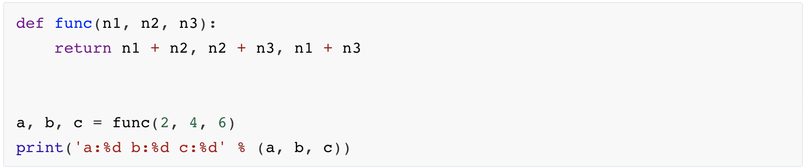

- [ ] `a:6 b:8 c:10`
- [ ] `a:6 b:10 c:8`
- [ ] `a:10 b:6 c:8`
- [ ] `a:10 b:8 c:6`

#### 6、以下对变量理解错误的是？

- [ ] 局部变量名不能和全局变量名相同
- [ ] `name` 和 `Name` 是不同的变量名
- [ ] 不同的函数，可以定义相同名字的局部变量
- [ ] 全局变量能够在所有的函数中进行访问

#### 7、阅读以下代码，关于不定长参数说法不正确的是？

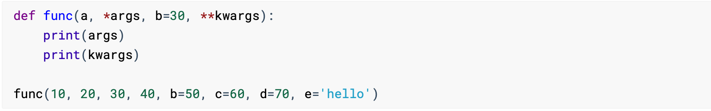

- [ ] 定义函数的时候，不定长参数可以用于接收多个位置实参
- [ ] 代码中形参 `args` 为元组类型
- [ ] 上述代码中, `args` 保存了实参 `10, 20, 30, 40`
- [ ] 上述代码中, `kwargs` 保存了实参 `c=60, d=70, e="hello"`

#### 8、以下代码输出结果？

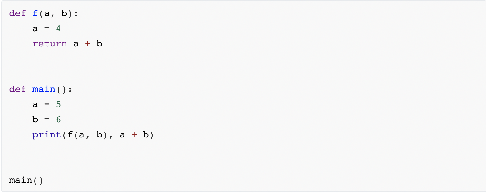

- [ ] 10 10
- [ ] 10 11
- [ ] 11 11
- [ ] 11 10

#### 9、下列关于函数的说法错误的是？

- [ ] 如果给一个函数提供了参数，那么该函数必须明确写出返回值
- [ ] 定义函数时，缺省参数一定要位于普通参数的后面
- [ ] 函数的参数的命名规则应当符合变量的命名规则
- [ ] `return` 的作用是用来返回数据、并且让函数结束

#### 10、关于下列代码描述错误的是？

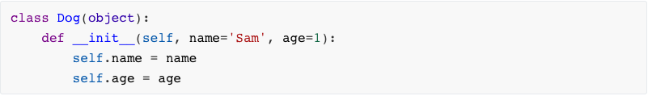

- [ ] `__init__` 方法有两个默认参数，该方法会在创建对象时自动调用
- [ ] `__init__` 方法的作用是在创建对象时，为实例对象进行初始化
- [ ] `sam = Dog()`这种方式是正确的创建对象的方式，实例对象 `sam` 的的 `name` 属性值为 `Sam` ,`age` 值为 `1`
- [ ] 对象创建时，会自动调用 `__init__` 方法，并将类做为参数传递给第一个参数 `self`

#### 11、已知有一个 test.txt 文件，以下对该文件的操作错误的是？

- [ ] A

  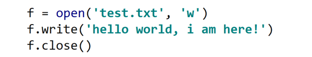

- [ ] B

  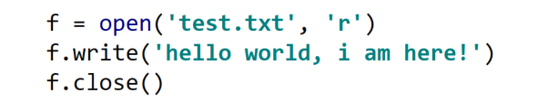

- [ ] C

  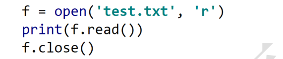

- [ ] D

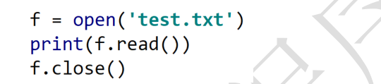

#### 12、以下字典定义的语法格式错误的是?

- [ ] ` a = {"name": "python"}`	 
- [ ] `a = {}`	 
- [ ] `a = dict()`	 
- [ ] `a = {name="python"}`

#### 13、以下代码片段执行结果为？

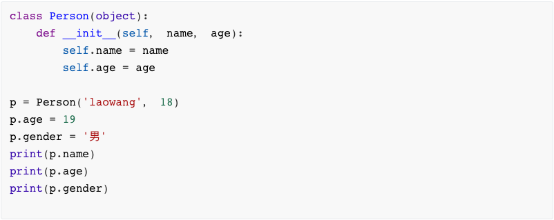

- [ ] laowang 
  18 
  男	 
- [ ] laowang 
  19
  男	 
- [ ] laowang 
  18
  报错 
- [ ] aowang 
  19
  报错

#### 14、下列说法错误的是?

- [ ] 类名一般使用大驼峰法命名	 
- [ ] 类一般由类的名称、属性、方法构成	 
- [ ] 一个类只能创建出一个对象	 
- [ ] 类中的方法，有的可以有`return`也可以没有`return`	 

#### 15、在Python中，创建文件夹的函数是？

- [ ] `os.rename`	 
- [ ] `os.path.chdir`	 
- [ ] `os.mkdir`	 
- [ ] `os.listdir`

### 二、代码题 (共计70分：得分___)
#### 16. 列表去重 (10分)

```python
'''代码在PyCharm写完，保证能够运行后直接拷贝到这里
结果：[1, 2, 3, 4, 5, 6, 7]
'''

```
#### 17. 文件拷贝(10分)

```python
'''代码在PyCharm写完，保证能够运行后直接拷贝到这里
	1. 用代码新建一个文件 A.txt
	2. 在里面写入 ==> 人生苦短，我用Python
	3. 用代码实现将 A.txt 内容拷贝到 B.txt
'''
+9
```

#### 18.  计算学员总成绩和平均分 (10分)

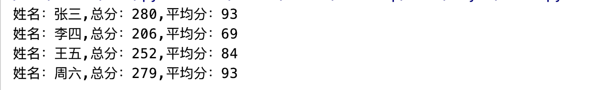

```python
'''代码在PyCharm写完，保证能够运行后直接拷贝到这里
已知列表中有一组学员的考试成绩，求每个学员的考试成绩总分和平均分,效果见上图
'''
scores_list = [{'name': '张三', 'math': 94, 'language': 87, 'english': 99},
               {'name': '李四', 'math': 76, 'language': 64, 'english': 66},
               {'name': '王五', 'math': 88, 'language': 85, 'english': 79},
               {'name': '周六', 'math': 90, 'language': 89, 'english': 100}]


```


#### 19.  使用循环嵌套打印九九乘法表(10分)

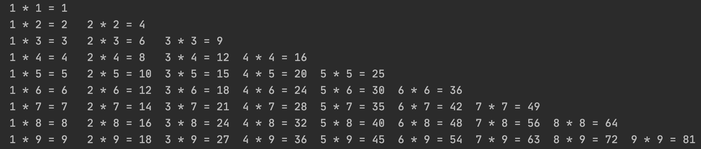

```python
'''代码在PyCharm写完，保证能够运行后直接拷贝到这里'''


```

#### 20.【函数版】实现一个简易的计算器-加减乘除(15分)

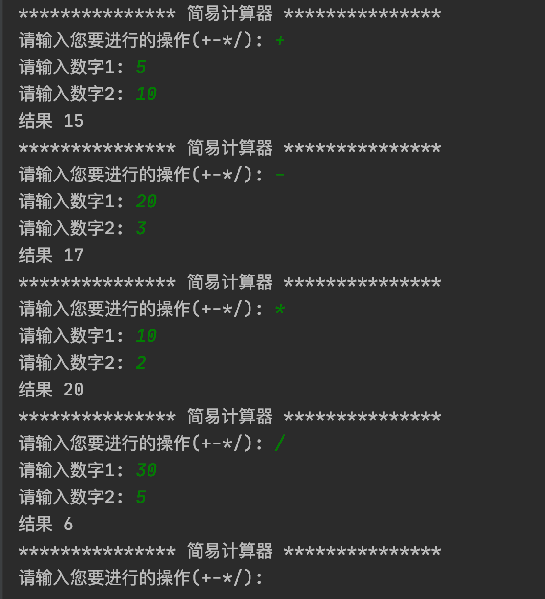

```python
'''代码在PyCharm写完，保证能够运行后直接拷贝到这里'''


```

#### 21. 面向对象(15分)

```python
""" 代码在PyCharm写完，保证能够运行后直接拷贝到这里
某公司有二种类型的员工 分别是部门经理、程序员
需要设计一个工资结算系统 根据提供的员工信息来计算月薪
部门经理的月薪是每月固定15000元
程序员的月薪按本月工作时间计算：每小时60元

定义一个员工类(Employee)
	实例属性
			姓名 name（私有属性）
	实例方法
			获取姓名 get_name()
			获取薪资 get_salary() 默认返回0

定义一个部门经理类(Manager)继承员工类
  实例属性
			姓名 name(不需要再次定义，调用父类的__init__方法)
			工作时间 working_hour
	实例方法
			获取薪资 get_salary() 按照固定薪资返回

定义一个程序员类(Programmer)继承员工类
	实例属性
			姓名 name(不需要再次定义，调用父类的__init__方法)
			工作时间 working_hour
	实例方法
			获取薪资 get_salary()  按照工作时间 * 每小时工资返回

要求:
已知员工信息如下,求列表中员工本月的薪资情况
emps = [
    {'姓名': '刘备', '职位': 'Manager', '工作时间': 160},
    {'姓名': '张飞', '职位': 'Programmer', '工作时间': 200},
    {'姓名': '赵云', '职位': 'Programmer', '工作时间': 180}
]
输出结果
    姓名: 刘备, 薪资: 15000
    姓名: 张飞, 薪资: 12000
    姓名: 赵云, 薪资: 10800
"""
```

```python

```
